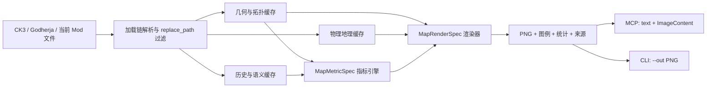

# ck3-index 地图生成系统技术设计

> 文档状态：基础设计已批准，增量开发中
> 文档版本：1.2
> 对应实现日期：2026-07-13
> 适用范围：`ck3-index` 地图索引、指标计算、历史地图集渲染、MCP 与 CLI 接口

## 1. 审批摘要

地图生成系统不是一个单独的“截图函数”，而是一条由四个阶段组成的数据管线：

1. 扫描 CK3、Godherja 与当前子 Mod 的地图事实。
2. 将省份几何、法理拓扑、历史字段和物理地理缓存进 SQLite。
3. 按年份、区域和行政等级构建可审计指标。
4. 将指标组合为填色、边界、节点、联系线和标签，输出 PNG 与来源元数据。

当前实现已经支持：

- 省份、男爵领、伯爵领、公国、王国、帝国六级地图。
- 政治、文化、信仰、游戏内发展度、地形与模型自定义专题图。
- 省份像素级 RLE 几何、各级头衔邻接、历史字段解析与增量缓存。
- 暗海旧纸历史地图集风格、双语标签、完整图例和 2 倍超采样。
- 最高 `8192x4096` 输出；支持与 `provinces.png` 同级的原生分辨率画布。
- 高度图多尺度浮雕、河流、海岸、等高刻线，以及 `map_object_data` 山峰/悬崖锚点、植被和地产 locator。
- MCP 内存 PNG 返回和 CLI 显式文件输出。
- 索引事实、派生指标、模型推演三种来源标识。

本文将“已实现能力”和“后续候选能力”分开描述。未实现内容不得在 MCP 返回中伪装成现有能力。

## 2. 设计目标与边界

### 2.1 目标

- **事实可靠**：政治归属、文化、信仰、发展度、地形和坐标必须来自当前有效 Mod 加载链。
- **可组合**：模型不需要修改 Go 代码即可组合专题指标和五类固定图层。
- **可审计**：每个指标返回来源、覆盖率、分位数、异常值和缺失值。
- **确定性**：相同索引、相同 spec 必须生成相同 PNG。
- **只读安全**：MCP 不写 Mod，不接受任意 SQL、脚本表达式或任意文件路径。
- **高分辨率**：允许 4K 级输出，同时保持线条、标签和图例随分辨率缩放。
- **增量性能**：历史文本变化不得触发 `provinces.png` 或 `heightmap.png` 的重新解码。

### 2.2 非目标

第一版不负责：

- 时间动画。
- 多面板排版。
- 浏览器交互地图。
- CK3 3D 场景复刻。
- 直接修改游戏地图或历史文件。
- 自动把所有 `map_object_data` 对象画进政治地图。
- 现实公里制比例尺。

## 3. 总体架构



### 3.1 主模块

| 模块 | 文件 | 职责 |
|---|---|---|
| 加载链与扫描 | `internal/indexer/config.go`, `scan.go` | 解析 source rank、descriptor `replace_path`，确定当前有效文件 |
| 地图上下文 | `internal/indexer/map_context.go` | 省份颜色反查、RLE 几何、边界、质心、法理树、历史与邻接缓存 |
| 物理地理 | `internal/indexer/map_physical.go` | 高度图、河流、多尺度浮雕、等高信息、山峰/悬崖锚点缓存 |
| 地图对象 | `internal/indexer/map_objects.go` | 植被 transform 分类抽样、地产 locator、坐标翻转与省份归属缓存 |
| 地图查询 | `internal/indexer/map_context_llm.go` | 省份信息、邻域、空间关系、头衔上下文、特建候选等查询 |
| 指标引擎 | `internal/indexer/map_metric.go` | 聚合字段、配方、统计、异常值、图传播与来源控制 |
| 政治配色 | `internal/indexer/map_color.go` | sRGB/OKLab/OKLCH 转换、原色协调、邻接色差优化 |
| 栅格渲染 | `internal/indexer/map_render.go` | 视口、图层、纹理、边界、标签、图例、地图集构图与 PNG 编码 |
| 地图符号 | `internal/indexer/map_symbols.go` | 植被图标、地产类型图标、屏幕空间稀疏化与首府优先级 |
| 地理语义 | `internal/indexer/map_geography.go` | 显式战略通道分类、湖泊连通体、沿岸关系与独立指纹 |
| 地表材质 | `internal/indexer/map_materials.go` | 材质顺序解析、TGA 流式解码、全图材质栅格与省份材质占比 |
| 地理渲染 | `internal/indexer/map_geography_render.go` | 海峡、渡口、山口、地下门户、外置入口和可选湖泊符号 |
| SQLite 模型 | `internal/indexer/db.go` | 地图表结构、重建和索引生命周期 |
| MCP 适配 | `mcp.go` | 工具 schema、输入约束、JSON 文本与 PNG ImageContent 返回 |
| CLI 适配 | `main.go` | `map recipes`, `map metric`, `map render --out` |
| 验收测试 | `internal/indexer/map_render_test.go`, `map_context_test.go`, `mcp_test.go` | 几何、缓存、指标、配色、渲染、MCP 与 PNG 回归测试 |

## 4. 数据源与加载优先级

### 4.1 默认来源优先级

1. 当前子 Mod，rank 1。
2. Godherja 上游，rank 2。
3. CK3 游戏本体，rank 3。
4. Godherja 中文翻译，rank 4。

数字越小优先级越高。同相对路径文件由高优先级来源覆盖。descriptor 中的 `replace_path` 会隐藏对应目录下的低优先级文件。

此规则对地图尤为重要。若忽略 `replace_path`，上游或原版文化、信仰和头衔会混入当前 Mod，生成看似合理但事实错误的专题图。

### 4.2 当前读取的地图输入

| 输入 | 用途 |
|---|---|
| `map_data/definition.csv` | 省份 RGB 到省份 ID 的唯一映射 |
| `map_data/provinces.png` | 精确省份填充、边界、面积、质心、周长与邻接 |
| `map_data/default.map` | 海域、湖泊、河流省份、不可通行山地等阻断类型 |
| `map_data/heightmap.png` | 坡向阴影、曲率细节、高程与等高刻线 |
| `map_data/rivers.png` | 河道像素掩码 |
| `map_data/adjacencies.csv` | 海峡、渡口、山口、地下与异地图显式连接 |
| `gfx/map/map_object_data/lakes.txt` | 湖泊视觉 locator，用于逻辑湖体交叉验证 |
| `gfx/map/terrain/materials.settings` | 顺序敏感的地表材质目录与贴图路径 |
| `gfx/map/terrain/detail_index.tga`, `detail_intensity.tga` | 世界空间材质候选索引与混合强度 |
| `common/province_terrain/*.txt` | 省份地形和默认陆海地形 |
| `common/landed_titles/*.txt` | 法理树、头衔颜色、首都、男爵领到省份映射 |
| `history/provinces/*.txt` | 文化、信仰、地产、建筑、特建与省份发展度历史 |
| `history/titles/*.txt` | 持有者和伯爵领发展度历史 |
| `history/characters/*.txt` | 历史持有者的名称、文化和信仰 |
| `common/religion/**` | 圣地及其信仰关联 |
| `common/geographical_region/**`, `map_data/*region*.txt` | 地理区域成员关系 |
| `gfx/map/map_object_data/*mountain*`, `*cliff*` | 山峰与悬崖 transform，压成物理锚点栅格 |
| `gfx/map/map_object_data/building_locators.txt` | 省份地产 locator 的真实 X/Z、旋转和缩放 |
| `gfx/map/map_object_data/generated/tree_*`, `reeds_*`, `*bush*` | 植被实例 transform，经确定性抽样后写入符号缓存 |
| `localization/**` | 中文、英文地图标签和图例名称 |

## 5. SQLite 地图缓存

### 5.1 表结构

| 表 | 核心字段 | 说明 |
|---|---|---|
| `map_provinces` | `province_id`, `color_rgb`, `center_*`, `min/max_*`, `area`, `perimeter`, `terrain`, 五级头衔列 | 每个省份的几何、物理类型与法理归属 |
| `map_province_geometry` | `fill_rle`, `boundary_rle`, `format` | 精确填充区域和边界的扫描线 RLE |
| `map_physical_rasters` | `layer_key`, `width`, `height`, `format`, `fingerprint`, `data` | PNG 压缩的灰度物理栅格 |
| `map_object_instances` | `object_kind`, `subtype`, `object_name`, `province_id`, `x/y`, `rotation`, `scale`, `source_*` | 可查询的植被和地产 locator 实例 |
| `map_adjacencies` | `province_id`, `neighbor_id`, `border_len`, `blocked` | 双向省份邻接与共享边长 |
| `map_strategic_adjacencies` | `from/to_province`, `passage_kind`, `through_province`, locator、距离、地下标记 | `adjacencies.csv` 的显式通道；不参与普通边界传播 |
| `map_water_bodies` | `water_body_id`, 面积、质心、边界框、岸线、locator 数量 | 相邻湖泊省份合并后的逻辑水体 |
| `map_water_body_provinces` / `map_water_body_shores` | 水体、省份、沿岸省份、共享边长 | 湖面组成与陆地沿岸关系 |
| `map_surface_materials` | `material_index`, `material_id`, diffuse/normal/properties/mask | `materials.settings` 中顺序敏感的材质定义 |
| `map_province_materials` | `province_id`, `material_index`, `sample_count`, `share`, `rank` | 每省前四种地表材质及抽样占比 |
| `map_surface_rasters` | `layer_key`, `width`, `height`, `format`, `fingerprint`, `data` | 全图主材质索引与强度 PNG 栅格 |
| `map_title_adjacencies` | `level`, `title_id`, `neighbor_id`, `border_len`, `blocked_border_len`, `water_border_len` | 男爵领至帝国的聚合邻接 |
| `map_titles` | `title_id`, `title_type`, `color_rgb`, `parent_id`, `capital_title`, bbox/center | 头衔树、原生颜色和空间摘要 |
| `map_title_provinces` | `title_id`, `province_id` | 头衔到省份的完整覆盖 |
| `map_province_history` | `province_id`, `date_key`, `field`, `value` | 省份历史时间序列 |
| `map_title_history` | `title_id`, `date_key`, `field`, `value` | 头衔历史和发展度变化 |
| `map_characters` / `map_character_history` | 角色与历史字段 | 地图持有者摘要 |
| `map_holy_sites` / `map_holy_site_faiths` | 圣地位置与信仰 | 宗教专题图节点 |
| `map_province_regions` | 省份、区域 | 区域筛选与地理标签 |

### 5.2 RLE 几何格式

`map_province_geometry` 使用 `i32le_y_x0_x1_v1`：

```text
int32 y
int32 x0
int32 x1
```

每条记录 12 字节，表示一条横向闭区间。填充 RLE 可以逐像素重建 `provinces.png`；边界 RLE 仅保留四邻域边缘像素。

选择 RLE 的原因：

- CK3 省份是大块连续区域，横向游程压缩率高。
- 裁剪、填色和边界绘制不需要解析复杂矢量拓扑。
- 能保留岛屿、孔洞和碎片，不会因多边形简化丢失小岛。
- 数据库可直接按省份读取，不必每次重扫整张 PNG。

### 5.3 几何计算

扫描 `provinces.png` 时完成：

- `color_rgb -> province_id` 反查。
- 面积：像素计数。
- 质心：`sum(x)/area`, `sum(y)/area`。
- 边界框：最小和最大 X/Y。
- 周长：四邻域中接触图外或不同省份的边数。
- 邻接：两个不同省份共享四邻域边时累加 `border_len`。
- 双向记录：`A -> B` 与 `B -> A` 数值一致。

### 5.4 头衔拓扑聚合

`landed_titles` 被解析为父子树。男爵领的 `province` 向上累积到伯爵领、公国、王国和帝国。

聚合邻接规则：

- 同一头衔内部的省份边界消失。
- 两个不同头衔之间的共享省份边界累加为头衔边界长度。
- 任一侧是阻断省份时计入 `blocked_border_len`。
- 任一侧是水域省份时计入 `water_border_len`。
- 每一级分别缓存，指标传播不需要临时 GROUP BY 全图。

## 6. 增量失效策略

### 6.1 几何指纹

几何指纹只依赖：

- `definition.csv`
- `provinces.png`
- `default.map`

三者内容哈希未变化时，不重建：

- 省份颜色和几何。
- RLE。
- 省份像素邻接。
- 面积、周长、质心和边界框。

### 6.2 物理地理指纹

物理指纹依赖：

- `heightmap.png`
- `rivers.png`
- 当前有效的 mountain/cliff `map_object_data` 文件

物理栅格格式当前为 `png_gray8_v2`。输入未变化时直接复用 SQLite BLOB 和进程内解码缓存。

### 6.3 语义刷新

- 修改省份历史：刷新历史字段和依赖结果，不解码省份图或高度图。
- 修改头衔历史：刷新持有者、发展度等历史，不重建几何。
- 修改 `landed_titles`：刷新法理树、头衔颜色、头衔覆盖和聚合邻接。
- 修改高度图、河流或 mountain/cliff 对象：只使物理缓存失效。

### 6.4 地图符号指纹

植被与地产 locator 使用独立对象指纹，依赖：

- `definition.csv` 与 `provinces.png`，用于坐标到省份的精确归属。
- 当前有效的 `building_locators.txt`。
- 当前有效的树木、芦苇和灌木 generated transform 文件。
- 内部对象缓存格式版本 `map_objects_v1`。

修改省份文化、信仰、地产类型或其他历史字段不会重建 locator。渲染地产符号时按统一的 `year` 查询当年 `holding`，因此同一个 locator 可以随历史显示为城堡、城市、教会或部落聚落。

### 6.5 当前实现注意点

`rebuildMapCache` 每次扫描仍会清空并重建若干语义表，但几何和物理栅格受独立指纹保护。后续可进一步细分语义表的依赖图，但这不影响当前事实正确性。

## 7. 物理地理模块

### 7.1 五层物理栅格

真实工程当前可生成五层：

| `layer_key` | 来源 | 用途 |
|---|---|---|
| `hillshade` | 高度图 | 多方向坡向明暗和地形体量 |
| `terrain_detail` | 高度图 | 中小尺度曲率、山脊和沟谷细节 |
| `elevation` | 高度图 | 稀疏等高刻线与高地约束 |
| `rivers` | 河流图 | 蓝青色河道掩码 |
| `terrain_anchors` | mountain/cliff transform | 制作者人工布置的山峰与悬崖方向锚点 |

没有 `map_object_data` 锚点文件时，前四层仍可正常生成。

### 7.2 多尺度浮雕算法

每个高度像素同时计算：

- 细尺度梯度：偏移 1 像素。
- 宽尺度梯度：偏移 4 像素。
- 细尺度局部均值：偏移 2 像素。
- 宽尺度局部均值：偏移 5 像素。

组合梯度：

```text
dx = 0.62 * dx_fine + 0.38 * dx_broad
dy = 0.62 * dy_fine + 0.38 * dy_broad
normal = normalize(-dx, -dy, 1)
```

照明由西北 `315°` 主光和东北 `45°` 辅光组成：

```text
shade = 0.72 * light(315) + 0.28 * light(45)
```

曲率信号：

```text
curvature = 42 * (h0 - fine_mean) + 18 * (h0 - broad_mean)
```

曲率小幅修正 hillshade，同时单独写入 `terrain_detail`。这样大山体不依赖局部噪声，山脊也不会被宽尺度平滑吞掉。

### 7.3 等高刻线

渲染时从 `elevation` 读取高程，将 `0..1` 分成 18 个等级。相邻采样跨越等级且局部高差超过阈值时，绘制低透明度暗线。

- `subtle` 透明度较低。
- `strong` 提高 hillshade、曲率、等高线和锚点强度。
- 低于高程阈值的平地不绘制等高刻线，避免全图出现规则条纹。

### 7.4 河流提取

河流图像素判定当前采用受限蓝色范围：

```text
R <= 12
B >= 90
B > G + 20
```

白色、洋红背景和红绿黄控制标记不会进入河流掩码。渲染时河流以低透明度暗蓝覆盖，不改变指标数据。

### 7.5 `map_object_data` 锚点

当前只选择相对路径中包含 `mountain` 或 `cliff` 的 `.txt` 文件。每条 transform 按 10 个浮点数解析：

```text
X Y Z  quaternion_x quaternion_y quaternion_z quaternion_w  scale_x scale_y scale_z
```

使用内容：

- 平面位置：X、Z。
- 方向：`2 * atan2(quaternion_y, quaternion_w)`。
- 尺寸：X/Z scale 的均值，限制在 `0.2..8`。
- 类型：由文件名归类为 mountain 或 cliff。

CK3 世界 Z 轴到图片 Y 轴可能需要翻转。系统比较 mountain 锚点在直接和翻转坐标下的“高程 + 崎岖度”总分，选择更符合高度图的一种全局方向。

每个锚点生成一个沿旋转方向延伸的椭圆高斯脊线。多个锚点取最大值，不做简单累加，避免密集区域过曝。

当前真实工程缓存了 `424` 个山峰/悬崖锚点。

### 7.6 植被与地产对象

`map_object_instances` 当前写入两类对象：

- `vegetation`：阔叶、针叶、密林、棕榈、芦苇、灌木和枯木。
- `holding`：`building_locators.txt` 中以省份 ID 为键的地产位置。

植被 generated 文件可能包含数十万条 transform。扫描器以全图 `64x64` 源像素网格做确定性抽样，每格保留稳定哈希最小的一条；水域实例会被排除。渲染阶段再按输出像素网格稀疏化，防止 4K 地图变成密集树墙。

地产 locator 保留完整省份 ID、位置、旋转、缩放和来源。渲染时按历史地产类型选择城堡、城市、大都会、教会、部落、游牧营地、废墟、墓园或通用聚落符号；`none`、荒地和空地产不绘制。县首府增加外圈强调，并在屏幕空间冲突时优先保留。

Z 轴方向优先通过 locator 省份 ID 与 `provinces.png` 的直接/翻转命中数判定；命中数相同时比较 locator 到省份质心的总距离。

### 7.7 暂未纳入默认底图的对象

以下文件具有地理价值，但尚未进入通用缓存：

- 废墟和特殊建筑 locator：适合遗迹/考古专题图。
- 桥梁：适合交通节点与跨河走廊。
- 湖泊对象：只用于连通体和 locator 交叉验证；内置地图不再默认绘制湖泊图标。
- 环境动物、特效、战斗、围城和军队 stack locator：主要服务运行时表现，默认不作为政治地理事实。

### 7.8 战略通道与湖泊

`adjacencies.csv` 是显式交通规则，不等同于 `provinces.png` 的像素接壤。扫描器将两者严格分表：`map_adjacencies` 只承载自然边界和指标传播，`map_strategic_adjacencies` 承载海峡、海路、河流渡口、山口和特殊入口。这样地下城连接不会让发展度、文化或政治邻接错误地跨越整张地图传播。

导入器兼容首行 UTF-8 BOM 和生成器注释，并按端点地形、连接类型和像素距离分类。长距离阈值为 `max(250px, map_diagonal * 0.05)`：

- 地下地形之间的短连接为 `underground_internal`。
- 任一端是地下地形且超过阈值为 `underground_gateway`。
- 非地下的超长连接为 `offmap_gateway`。
- `river` / `river_large` 为 `river_crossing`，`mountain` 为 `mountain_pass`。
- 海上短连接为 `strait`，其余为 `sea_route`。

地下与异地图入口只绘制端点门户和短虚线引线，禁止画穿全图的直线。普通通道使用曲线且没有箭头；世界尺度自动降低海峡和渡口透明度，区域地图恢复完整强度。

湖泊由 `terrain=lake` 的省份按像素邻接合并为连通体，稳定 ID 取组成省份的最小编号。缓存同时保存面积加权质心、边界框、岸线长度、组成省份和沿岸陆地；目标裁剪通过沿岸省份选择湖体，因此阻断的湖面省份不会被错误排除。`lakes.txt` locator 只作为视觉位置计数和交叉验证，不覆盖省份水域事实。内置地图以显著亮于海域的蓝色湖面表达湖泊，不再叠加中心图标；显式自定义图层仍可调用湖泊 marker 作为兼容能力。

### 7.9 地表材质组合

`materials.settings` 中叶材质的声明顺序与 CK3 材质索引一致。扫描器保存每个材质的 diffuse、normal、properties 和 mask 路径，并流式读取 8192x4096 的 `detail_index.tga` 与 `detail_intensity.tga`：

- `detail_index.tga` 的 BGRA 通道给出候选材质索引。
- `detail_intensity.tga` 的对应通道给出候选材质权重。
- 每像素选择最高权重候选，生成主材质索引与强度两张 PNG 灰度栅格。
- 每四个源像素抽样一次，按省份累计前四种材质、样本数、占比与排序。

`*_mask.png` 均为世界空间 8192x4096 mask。第一版将其路径保存在材质目录中用于审计和交叉验证，运行时以已经完成组合的 detail index/intensity 为主，避免每次索引或渲染重新混合全部 mask。材质栅格位于政治填色之下、hillshade 之前，只提供低透明度地表差异；指标引擎另暴露 `surface_material` 和 `surface_material_diversity`。

## 8. 指标引擎

### 8.1 `MapMetricSpec`

核心字段：

| 字段 | 说明 |
|---|---|
| `recipe` | 内置指标配方 ID |
| `target` | 省份、头衔、逗号分隔多个 ID，或 `all` |
| `id_prefix`, `id_pattern` | 可选命名空间过滤；正则最长 128 字符 |
| `level` | `province/barony/county/duchy/kingdom/empire` |
| `year` | 查询历史字段的脚本年份 |
| `kind` | `numeric` 或 `category` |
| `field` | 单字段指标 |
| `aggregate` | `count/sum/mean/max/majority/diversity/ratio` |
| `components` | 多字段权重组件 |
| `transform` | 邻接图变换 |
| `values` | 模型提交的自定义值 |
| `source_note` | 自定义值必填来源说明 |
| `provenance` | `indexed/derived/model` |

### 8.2 可用事实字段

- `entity_id`
- `holding`
- `terrain`
- `culture`
- `religion`
- `development` / `development_level`
- `special_building`
- `building_count`
- `is_county_capital`
- `area`

### 8.3 聚合语义

- `count`：按存在性计数。
- `sum`：省份组件总和。
- `mean`：省份组件均值。
- `max`：数值最大值。
- `majority`：分类票数最多者；平票按 ID 字典序确定，保证结果稳定。
- `diversity`：归一化 Shannon entropy，范围约为 `0..1`。
- `ratio`：等于 `match_value` 的有效观测比例。

发展度是伯爵领级数据。向更高层级聚合时先按伯爵领去重，避免同一伯爵领因多个男爵领重复计数。默认 `max` 用于避免伯爵领发展度被男爵领数量稀释；公国及以上自适应发展度图默认使用 `mean`。

### 8.4 多组件指标

每个 `MapMetricComponent` 可指定：

- `field`
- 分类权重表 `weights`
- 未命中默认值 `default`
- 系数 `multiplier`
- 存在性模式 `presence`

单省分数：

```text
province_score = sum(component_score * multiplier)
```

实体分数再按 `sum` 或 `mean` 聚合。

### 8.5 图变换

#### `high_to_low`

只接受高值邻居对低值节点的正向差值：

```text
next(v) = current(v) + rate * weighted_mean(max(neighbor - current, 0)) * absorption(v)
```

#### `neighbor_mean`

允许正负差值，将节点向邻居加权均值拉近：

```text
next(v) = current(v) + rate * weighted_mean(neighbor - current) * absorption(v)
```

#### `distance_decay`

从 `seeds` 做无权 BFS：

```text
value(v) = value(v) * decay ^ graph_distance(v, seeds)
```

边权可用统一权重或 `border_len`。变换支持轮次、逐轮传播率、上限、下限和地形吸收。

地形吸收示例：农田、洪泛平原、绿洲为 `1.0`；平原、森林、草原为 `0.85`；山地和沙漠山地为 `0.25`。

### 8.6 输出统计

`MapMetricResult` 返回：

- 实体值列表。
- 覆盖数与缺失数。
- 最小值、最大值、均值。
- P10、中位数、P90。
- 分类计数。
- 异常值。
- 来源、公式展开结果和警告。

### 8.7 自定义值安全规则

模型自定义值必须：

- 提供非空 `source_note`。
- ID 必须属于目标区域和所选层级。
- 不得重复 ID。
- 不得提交 NaN 或 Infinity。

接受后 provenance 强制改为 `model`，不能冒充 `indexed`。

## 9. 内置配方

| 配方 | 类型 | 当前实现 |
|---|---|---|
| `development_network` | 派生指标 | 地产权重 + 地形权重 + 3 轮高到低传播 |
| `cultural_frontier` | 索引指标 | 主流文化；可额外组合 diversity 层 |
| `faith_and_holy_sites` | 索引指标 | 主流信仰 + 圣地节点建议 |
| `special_building_constellation` | 索引指标 | 特建数量和特建节点建议 |
| `capital_gravity` | 派生指标 | 地产权重 + 伯爵领首都 + 邻接平均 |
| `settlement_terrain_gap` | 派生指标 | 地形潜力减去实际地产强度 |
| `duchy_political_atlas` | 渲染配方 | 兼容入口，转为公国级 `political_atlas` |
| `political_atlas` | 自适应渲染 | 男爵领至帝国政治地图 |
| `thematic_atlas` | 自适应渲染 | 文化、信仰、游戏内发展度、地形、自定义专题图 |
| `strategic_waterways_atlas` | 渲染配方 | 固定帝国级政治块与帝国名称、亮蓝湖面和显式战略通道；默认不绘制植被、地产或湖泊图标 |

重要区分：

- `development_network` 是派生模型，不等于游戏内发展度。
- `thematic_atlas + theme=development` 读取历史中的 `development_level` 和 `change_development_level`。

## 10. 渲染器

### 10.1 `MapRenderSpec`

`width` 与 `height` 均省略时，渲染器进入自动分辨率模式：综合目标省份数量、标签粒度、地产/植被/流线等细节层、浮雕强度与版式复杂度，在 2K、4K、8K 级长边中选档，并保持目标地图纵横比。显式宽高仍作为精确画布覆盖；返回结果通过 `resolution_mode` 和 `resolution_reason` 说明选择。

主要受限枚举：

- `style`: `standard`, `historical_atlas`
- `layout`: `map_only`, `light_frame`, `full_atlas`
- `relief_strength`: `none`, `subtle`, `strong`
- `label_language`: `chinese`, `english`, `bilingual`
- `color_strategy`: `native`, `muted`, `coordinated`
- `supersample`: `1`, `2`
- `theme`: `political`, `culture`, `faith`, `development`, `terrain`, `custom`

尺寸规则：

- 默认宽度 `1600px`。
- 最大画布由 `MapRenderMaxWidth = 8192` 与 `MapRenderMaxHeight = 4096` 共同控制。
- 显式提供宽度和高度时，返回精确尺寸画布；目标区域保持纵横比并居中放置。
- 未指定高度时按目标区域边界框自动计算，但仍受 `4096px` 高度上限约束。
- 目标区域自动裁剪并加固定输出像素 padding。
- 边界、标签、图例、图框、地产、植被、可选标记、门户和通道以最终 PNG 像素为单位。`1600px` 以上保持固定大小，低分辨率画布最低缩放到 `0.5x`。
- 超采样只扩大内部绘制尺寸，不改变最终视觉尺寸。宽度超过 `4096px` 的内置地图默认使用 `supersample=1`；约 4800 万工作像素的预算阻止 8K 二倍超采样造成失控内存占用。

### 10.2 五类固定图层

| 图层 | 作用 | 主要参数/来源 |
|---|---|---|
| `fill` | 数值或分类填色 | metric、palette、classes、min/max、no_data、texture |
| `borders` | 省份/头衔/外框边界 | level、source、color、line_width、title_color |
| `markers` | 首都、圣地、特建、植被、地产或显式节点 | source、ids、color、line_width、limit |
| `flows` | 指标传播或模型联系线 | metric、edges、threshold、limit |
| `labels` | 分类、实体、头衔、首都或高值标签 | source、level、ids、limit |

禁止任意 SQL、任意脚本和任意自定义绘图代码。模型只能组合这五类。

### 10.3 渲染顺序

1. 创建目标画布和背景。
2. 绘制暗海纸张噪声。
3. 绘制水域和不可通行山体基础色。
4. 绘制一个或多个 fill 层。
5. 可选绘制传统 terrain overlay。
6. 历史地图集叠加 hillshade、curvature、elevation、terrain anchors 和 rivers。
7. 按 spec 顺序绘制 borders、markers、flows、labels；默认地图集在政治边界前画植被、在边界后和标签前画地产。
8. 绘制完整图例、标题、年份、图框、指北符号、相对尺度和来源徽记。
9. 使用 Catmull-Rom 从超采样画布缩回目标尺寸。
10. 编码 PNG，并返回尺寸、字节数、覆盖率、图例、指标和警告。

### 10.4 调色板

当前 catalog 暴露：

- `political`
- `political_muted`
- `political_coordinated`
- `development`
- `viridis`
- `magma`
- `blue_red`
- `categorical20`
- `parchment`

连续指标可自动使用数据范围，也可显式设置 `minimum` / `maximum`。分类图例最多 20 项，超出时当前会警告并截断，这是已知限制。

### 10.5 政治颜色协调

头衔原生 RGB 是色相锚点。流程：

1. sRGB 转线性 RGB。
2. 转 OKLab，再转 OKLCH。
3. 将明度约束到可读区间，并限制相对原色变化不超过 `±0.12`。
4. 将彩度压到 `0.045..0.13`。
5. 最多迭代 28 轮，对相邻近色头衔做反向微调。
6. 色相相对原色内部限制在 `±7°`，给公开 `±8°` 约束留转换余量。
7. 目标相邻 OKLab 色差为 `0.075`；若原色约束冲突，优先保留原色锚定。

### 10.6 材质

政治填色不是纯色块。`political_material` 使用 ID 派生的确定性 seed 叠加：

- 低频墨色密度变化。
- 高频纸张颗粒。
- 轻微边缘和油墨不均匀。

所有头衔共享同一材质体系，不再按公国分配方向性斜纹。

### 10.7 边界层级

自适应配方从当前填色层级向上自动补齐边界。例如伯爵领填色默认增加：

- 公国边界。
- 王国边界。
- 帝国外框。

较高级边界使用暗色底边和内线。政治图的高级内线可采用协调后的头衔原色。

### 10.8 标签与本地化

标签优先级：

1. 简体中文本地化。
2. 英文本地化。
3. 两者均缺失时隐藏，并返回 warning。

历史地图集不会把 `d_*` 等脚本键当作最终可见标签。MCP 不允许客户端提交字体路径；服务器通过 `CK3_INDEX_MAP_FONT` 配置 CJK 字体。CLI 是本地显式调用，可在 JSON 中使用 `font_path`。

双语标签：中文主标题，英文小号副标题。帝国、王国、公国使用不同字号，并按政治等级与面积排序。当前碰撞处理是确定性矩形避让，不支持弯曲文字。

世界尺度的 `strategic_waterways_atlas` 固定使用帝国级填色和帝国实体标签。即使旧调用仍传入 `level=duchy`，配方也会升级为帝国块，避免 8K 总览退化成公国碎片拼图。

### 10.9 图例

图例由政治层级、物理符号和专题分类共同组成。旧版固定只显示 12 项；当前版本根据画布可用高度计算每列行数，必要时向左自动增加列，不再静默丢失尾项。

## 11. MCP 接口

### 11.1 `map_recipe_catalog`

无参数。返回：

- 可用层级。
- 聚合方式。
- 图变换。
- 字段。
- 图层类型。
- marker 来源：`capitals`、`holy_sites`、`special_buildings`、`vegetation`、`holdings`。
- 调色板。
- style/layout/theme。
- 九种内置配方和调用指导。

### 11.2 `map_build_metric`

输入 `MapMetricSpec`，只计算指标，不生成图片。用于：

- 审核公式。
- 查看覆盖率和缺失值。
- 检查分位数和异常值。
- 调整传播率和上限。
- 在渲染前确认模型自定义值是否合法。

### 11.3 `map_strategic_passages`

按 `target`、`kind` 和 `limit` 查询显式战略通道。结果包含端点省份、分类、连接类型、locator、像素距离、地下标记和来源注释；它不会把这些连接伪装成普通共享边界。

### 11.4 `map_render`

输入 `MapRenderSpec`。MCP 返回两段 content：

1. `text`：JSON 元数据、图例、指标、覆盖率、警告和来源。
2. `image`：Base64 编码的 `image/png`。

PNG 在内存中生成，不写入 Mod 或临时输出目录。

### 11.5 MCP 安全边界

- 拒绝客户端传入 `font_path`。
- width schema 与核心共享 `MapRenderMaxWidth`。
- 不接受输出路径。
- 不接受 SQL。
- 不接受脚本表达式。
- 自定义值必须提供来源说明。
- 未知 ID、重复 ID、非有限值直接报错。

## 12. CLI 接口

```text
ck3-index map recipes
ck3-index map metric <spec.json>
ck3-index map render <spec.json> --out <file.png>
```

CLI 与 MCP 使用同一指标和渲染核心。区别：

- CLI 只有明确提供 `--out` 才写文件。
- CLI 可使用本地 `font_path`。
- CLI 返回 JSON 元数据到标准输出，不返回 Base64 图片。

## 13. 调用示例

### 13.1 4K 文化地图集

```json
{
  "recipe": "thematic_atlas",
  "theme": "culture",
  "target": "e_chevalie",
  "level": "county",
  "year": 1254,
  "width": 3840,
  "relief_strength": "strong",
  "supersample": 2
}
```

### 13.2 公国政治地图

```json
{
  "recipe": "political_atlas",
  "target": "e_test",
  "level": "duchy",
  "width": 2400,
  "color_strategy": "coordinated",
  "label_language": "bilingual"
}
```

### 13.3 游戏内发展度地图

```json
{
  "recipe": "thematic_atlas",
  "theme": "development",
  "target": "e_test",
  "level": "county",
  "year": 1254,
  "year": 6254
}
```

### 13.4 模型推演旧帝国影响圈

```json
{
  "target": "e_test",
  "width": 2000,
  "style": "historical_atlas",
  "layout": "full_atlas",
  "layers": [
    {
      "type": "fill",
      "level": "county",
      "palette": "magma",
      "source_note": "Model hypothesis based on ruin density and narrative evidence.",
      "values": [
        { "id": "c_example", "value": 8.5 }
      ]
    },
    { "type": "borders", "level": "duchy" },
    { "type": "labels", "source": "top_metric", "limit": 12 }
  ]
}
```

该图必须在来源中显示为 `model`，不能标记为索引事实。

## 14. 性能与资源

当前真实工程观测值，不作为跨机器硬保证：

| 场景 | 结果 |
|---|---|
| 物理缓存重建，8192x4096 高度图 | 约 27 秒 |
| 舍瓦利耶 4K 级文化地图 | `3840x1710` |
| 4K 图缓存命中渲染 | 约 4.8 秒 |
| 4K PNG 大小，含地图符号 | 约 4.44 MB |
| 全世界战略水系 8K 验收图 | `8192x4096`，8309 个省份，700 条通道 |
| 8K PNG 大小 | 约 33.0 MB；132 个湖体符号，3 个门户端点 |
| 使用省份数 | 254 |
| 伯爵领指标覆盖 | 70/70 |
| 物理与地表材质栅格 | 6 层 |
| mountain/cliff 锚点 | 424 |
| 结构化植被抽样 | 2364 个，7 类 |
| 地产 locator | 8322 条，8316 个省份 ID |
| 可通行陆地 locator 覆盖 | 8302/8309，约 99.92% |
| 舍瓦利耶样图符号 | 植被 49，地产 170 |
| 对象缓存首次进入真实扫描的 map_context 阶段 | 约 7.1 秒 |

2 倍超采样会创建约目标宽高两倍的内部画布。4K 输出内部宽度可接近 7680px，内存压力明显高于 1600px 默认图。

推荐默认策略：

- 日常模型预览：1600px，`subtle`。
- 审批和发布图：2400px。
- 需要放大审查时显式请求 3840px，`strong` 或 `subtle`。
- 不建议把所有 MCP 调用默认改成 4K。

## 15. 测试与验收覆盖

当前自动测试覆盖：

- RLE 逐像素重建。
- RGB 反查、面积、周长、边界框和质心。
- 省份和各级头衔邻接聚合。
- 历史文件变化不重建几何或物理栅格。
- 高度图变化使物理指纹失效。
- 河流颜色控制点排除。
- 多尺度浮雕、曲率和高程栅格。
- mountain/cliff transform 解析和锚点 mask。
- 政治色原色锚定与邻接色差。
- 地产、地形、发展度、分类、多样性和传播指标。
- 植被分类抽样、地产 locator、对象缓存失效和历史地产类型图标。
- 自定义值缺少来源、未知 ID、重复 ID、Infinity 拒绝。
- PNG 确定性、尺寸、非空像素和可解码性。
- 显式宽高返回精确画布，目标地图保持纵横比并居中。
- 1600px、4K 二倍超采样和 8K 原生输出的边线/UI 最终像素尺寸一致；低分辨率允许缩小。
- 8K 原生输出允许，8K 二倍超采样因工作像素预算被明确拒绝。
- 双语标签和字体配置。
- 图例自动分栏且不丢项目。
- MCP 工具注册、text + PNG ImageContent。
- MCP width/height schema 与核心 `8192x4096` 上限一致。

当前全量命令：

```text
go test ./...
```

已通过。

## 16. 已知限制与风险

### 16.1 `map_object_instances` 仍是受限对象集

植被和地产 locator 已进入结构化实例表；mountain/cliff 仍压成 `terrain_anchors` 灰度栅格。当前对象表不保存完整 mesh/entity 定义，也没有收录桥梁、遗迹、特殊建筑、环境特效和动物。因此它能回答植被与地产的空间问题，但还不是 CK3 全量地图对象数据库。

### 16.2 Z 轴翻转是全局启发式

当前根据 mountain 锚点与高度图匹配度选择直接或翻转 Z。若某 Mod 的山峰对象本身大量偏离高度图，可能判断错误。建议后续把最终方向写入 meta 并在健康检查中报告置信差。

### 16.3 标签避让仍较基础

当前使用矩形碰撞和边缘约束，不支持：

- 曲线文字。
- 沿河流或山脉排字。
- 多候选锚点的全局优化。
- 图例与地图标签之间的联合避让。

### 16.4 图例可能遮挡地图

图例已经不再截断，但分类非常多时会向左增加列，占用地图面积。后续可增加：

- 外置边栏布局。
- 只显示区域内前 N 类并附完整文本清单。
- 超宽画布自动扩展，而不是覆盖地图。

### 16.5 8K 工作像素预算

最终画布最多 `8192x4096`。渲染前同时检查最终像素和 `width * height * supersample^2` 工作像素；超过约 4800 万工作像素时返回可操作错误。8K 原生输出可用，8K 二倍超采样被拒绝，现有 4K 二倍超采样仍可用。

### 16.6 物理参数仍是固定风格参数

当前梯度偏移、曲率权重、18 级等高线和透明度写在 Go 实现中。为了保证稳定性，这些参数没有开放成任意表达式。后续可增加受限 preset，例如：

- `relief=soft`
- `relief=engraved`
- `relief=mountain_emphasis`

不建议直接把每个系数暴露给模型。

### 16.7 分类色板上限

`categorical20` 最多提供 20 个分类色。文化或信仰超过 20 类时需要更大的确定性色板、分组或分页图例。

## 17. 建议后续模块

### 17.1 扩展 `map_object_instances`

当前已实现字段：

```text
id
object_kind
subtype
object_name
province_id
x, y
rotation
scale
source_name
source_rank
source_path
```

下一阶段建议增加 `mesh_or_entity`、原始三轴 scale、layer 和 locator 类型，并收录：

- 遗迹密度图。
- 桥梁与渡口走廊。
- 特殊建筑可视化。
- 森林/植被对象专题。
- 对象与省份、头衔的空间归属查询。

### 17.2 物理地理查询 MCP

建议增加受限工具：

- `map_physical_context`
- `map_object_catalog`
- `map_object_instances`

这些工具只返回索引事实，不接受文件路径。

### 17.3 图层布局系统

建议增加受限 layout：

- `full_atlas_sidebar`
- `map_only_clean`
- `publication_plate`

避免继续在一个 `full_atlas` 函数里堆叠所有排版分支。

## 18. 审批项

请重点审批以下决策：

1. 是否接受“索引事实、派生指标、模型推演”三类来源强制区分。
2. 是否接受 MCP 默认 1600px、显式允许最高 `8192x4096`，并保持所有 UI 与地图符号的最终像素尺寸固定。
3. 是否接受历史地图默认 `subtle`，`strong` 仅按请求开启。
4. 是否接受 mountain/cliff 继续压成物理栅格，而植被和地产先进入结构化 `map_object_instances`。
5. 是否接受 `development_network` 继续作为派生配方保留，但展示游戏发展度时默认使用 `theme=development`。
6. 是否批准下一阶段继续扩充对象实例表，制作遗迹/桥梁专题图和外置图例布局。

## 19. 审批结论记录

```text
审批状态：基础设计通过，植被与地产符号进入样图验收
审批人：ALZAWOK
审批日期：2026-07-13

批准项：地图生成基础架构；继续后续地图开发；植被和地产 locator 方向

要求修改：8K 世界总览改为帝国块并标注帝国名称；湖泊取消默认图标，仅以亮蓝水面与深色海域区分。

暂缓项：

备注：上述视觉修订于 2026-07-13 纳入文档版本 1.2 和验收测试。
```
