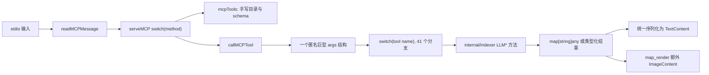
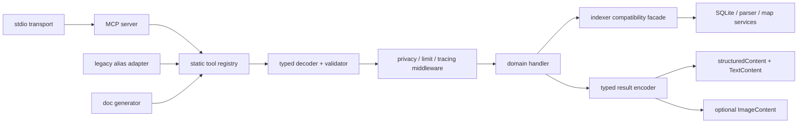

# ck3-index MCP Revival 技术设计

> 状态：**APPROVED / Phase 0–4 已实施；Phase 5 暂缓**
> 日期：2026-07-14
> 目标版本：`0.3.0`
> 审查时基线：`0.2.2`、41 个 MCP 工具
> 当前实现：`0.5.0`，只公开一套 canonical MCP 工具；历史 expert profile 与 28 个旧别名已在用户审批后移除。
> 审批结论：批准 A–G 与 I；H 暂缓。Phase 0–4 已完成，取消与并发仍等待单独审批。

## 1. 执行摘要

当前 MCP 能工作，但“工具产品层”和“协议实现层”已经发生明显漂移：

- `mcp.go` 同时承担 stdio 传输、JSON-RPC、工具目录、JSON Schema、参数兼容、隐私选项、调用分发、结果编码和健康信息整形。
- 实际注册 41 个工具，README 写 40，仓库内技能写 41，插件描述与已安装技能仍写 37。
- `ck3_inspect`、`inspect_object`、`diagnose_key` 的能力高度重叠；`query_*` 与高层入口同时暴露，模型需要在多个近义工具之间猜测。
- 所有工具先解码到一个巨型匿名参数结构。`map_assignment_plan.mode` 已与公共隐私参数 `mode` 冲突，只能靠专用分支补救。
- 核心已经支持 `region` 地图层级，但 MCP 的 `map_build_metric` 与 `map_render` schema 仍只允许到 `empire`。
- 工具执行错误统一返回 JSON-RPC `-32000`，没有使用 MCP 为模型自纠设计的 `isError: true` 工具结果。
- 工具没有 `title`、`annotations`、`outputSchema` 或 `structuredContent`；所有结构化 JSON 被塞入文本块。
- `tools.listChanged=true`，但服务端没有实现工具列表变化通知。

建议采用“**先无行为拆分，再收敛工具面**”的路线：

1. 先将 MCP 代码迁入独立包，并建立单一工具注册表；41 个现有工具名称、schema 和输出保持兼容。
2. 将每个工具改为独立的类型化参数与处理器，集中处理隐私、错误、结果编码和协议 annotations。
3. 默认公开目录收敛为 21 个 canonical 工具；旧工具作为隐藏兼容别名继续可调用两个小版本。
4. 工具注册表同时生成 MCP 目录、参考文档、README 表格和技能工具段，消除手工计数与描述漂移。
5. 数据库 schema、扫描器、CK3 解析器、诊断规则和地图视觉算法不属于本轮重构范围。

## 2. 范围与非目标

### 2.1 本轮范围

- MCP stdio 与 JSON-RPC 服务结构。
- 工具注册、命名、分组、描述和参数 schema。
- 工具调用分发、类型化参数解码、统一错误和统一结果编码。
- 隐私/公开模式的统一入口。
- MCP 2025-06-18 已支持的 tool annotations、结构化输出和 output schema。
- MCP 契约测试、兼容测试、文档生成和插件发布元数据。
- CLI 与 MCP 共用业务服务的边界设计；本轮只减少重复，不重写整个 CLI。

### 2.2 明确不做

- 不改变 SQLite 表结构、索引规则或数据含义。
- 不重写扫描器、解析器、引用解析器、scope checker 或诊断算法。
- 不调整地图色彩、地形、边界、图标、标签布局或分辨率决策算法。
- 不允许 MCP 直接写 CK3 工程文件；patch/review 工具继续只做内存覆盖检查。
- 不在第一阶段删除任何旧工具名称。
- 不在本审批稿内决定 `0.5.0` 是否彻底删除兼容别名。

## 3. 当前实现盘点

### 3.1 代码规模

| 文件 | 当前行数 | 职责现状 |
|---|---:|---|
| `mcp.go` | 762 | 协议、传输、41 个工具 schema、描述、分发、兼容参数、结果编码 |
| `mcp_test.go` | 507 | 传输、注册、地图、隐私和大量调用用例混在一个文件 |
| `main.go` | 643 | CLI 路由与部分 MCP 业务逻辑存在重复 |
| `internal/indexer/llm.go` | 946 | 通用 LLM 输出适配与多个相互重叠的聚合入口 |
| `internal/indexer/map_context_llm.go` | 1879 | 地图查询、规划与候选评分 |
| `internal/indexer/map_metric.go` | 1043 | 地图指标与配方 |
| `internal/indexer/map_render.go` | 2846 | 地图渲染业务；本轮不拆其算法 |

### 3.2 工具数量与描述漂移

| 位置 | 声明数量 | 事实 |
|---|---:|---|
| `mcp.go:mcpTools()` | 41 | 当前运行时事实 |
| `mcp_test.go` | 41 | 测试硬编码完整列表 |
| `skill/ck3-coding/SKILL.md` | 41 | 仓库技能副本 |
| `plugin/ck3-index/skills/ck3-coding/SKILL.md` | 41 | 插件暂存副本 |
| `README.md` | 40 | 已漂移 |
| `plugin/ck3-index/.codex-plugin/plugin.json` | 37 | 已漂移 |
| 已安装的 `ck3-coding` 技能 | 37 | 发布/安装副本落后于仓库 |

结论：工具数量、工具描述和技能内容没有单一事实来源。继续手工同步只会再次漂移。

### 3.3 当前调用链



该结构的问题不是单纯“文件太长”，而是目录、契约和实现没有结构性边界。

## 4. 已确认问题

### 4.1 P0：运行时契约漂移

1. **工具目录漂移**：37、40、41 三种计数并存。
2. **地图 schema 漂移**：`internal/indexer/map_metric.go` 已将 `region` 列为合法层级；`mcp.go` 的两个 level enum 仍不包含它。
3. **参数别名自相矛盾**：`map_assignment_plan` schema 宣称 `id` 是 `target` 别名，却仍把 `target` 标成必填。
4. **字段碰撞**：`mode` 同时表示公共隐私模式和地图分配模式，产生专用兼容分支。
5. **能力声明不实**：初始化声明 `tools.listChanged=true`，但没有发送 `notifications/tools/list_changed`。
6. **版本多处硬编码**：服务端、插件 manifest、启动脚本和发布脚本分别写死 `0.2.2`。

### 4.2 P1：模型工具选择困难

1. `ck3_inspect` 内部调用 `LLMDiagnoseKey`；`diagnose_key` 又直接暴露；`inspect_object` 提供另一份对象聚合结果。
2. 三个工具都被描述为“START HERE”，但没有互斥边界。
3. `prepare_edit` 已经聚合 examples、rules、patterns，三个底层查询仍同时放在默认目录。
4. 八个 `lookup_*` 工具只在“查询哪类引擎事实”上不同，却各占一个完整工具槽位。
5. `NextQueries` 在业务代码中硬编码旧工具字符串；工具改名会产生第二套漂移。
6. 通用 schema 给很多工具暴露无效字段，例如静态 `lookup_define` 也携带 `limit`、`mode`、`allow_project`。

### 4.3 P1：协议结果不利于模型自纠

当前服务声明 MCP 协议版本 `2025-06-18`。该版本已经支持：

- 工具 `title`、`annotations` 和 `outputSchema`。
- `CallToolResult.structuredContent`。
- 工具执行错误通过 `isError: true` 返回，使模型能够看到并修正参数。

官方依据：

- [MCP 2025-06-18 Tools](https://modelcontextprotocol.io/specification/2025-06-18/server/tools)
- [MCP 2025-06-18 Schema Reference](https://modelcontextprotocol.io/specification/2025-06-18/schema)

当前实现仍存在以下缺口：

- 没有 `annotations`，客户端只能采用最保守的副作用默认值。
- 没有 `structuredContent`，结构化 JSON 只能从文本中再次解析。
- 没有 `outputSchema`，客户端无法验证输出。
- 工具业务错误全部变成 JSON-RPC 错误，模型可能看不到可重试信息。

### 4.4 P2：维护与发布杂项

- `mcp-wrapper.js`、`mcp-server.bat`、`test-mcp.ps1` 与正式插件 PowerShell 启动链并存，职责和使用状态不明确。
- `plugin/ck3-index/config/settings.json` 含机器相关配置，不应作为通用发布模板的长期事实源。
- skill 在仓库、插件暂存目录和安装目录存在多份副本。
- `mcp_test.go` 的地图、协议、schema、隐私和工具业务测试耦合，失败定位困难。
- 服务循环顺序执行调用；长时间地图渲染期间无法及时响应 ping 或取消通知。
- Content-Length 输入没有显式请求体上限。

## 5. 设计原则

1. **注册即事实**：工具名称、描述、schema、annotations、处理器和兼容别名必须在同一注册定义中出现。
2. **先兼容后收敛**：结构迁移阶段不得改变现有 41 个工具行为。
3. **一个工具一个主要意图**：默认目录不暴露多个近义“首选入口”。
4. **高层优先，专家可用**：默认目录保持紧凑；专家 profile 可显示低层工具。
5. **输入类型化**：每个 canonical 工具使用自己的参数结构，不再先解码到万能 args。
6. **隐私集中执行**：公开模式由中间件统一过滤，不依赖每个处理器记得调用过滤函数。
7. **结构化且向后兼容**：返回 `structuredContent`，同时保留序列化 JSON TextContent。
8. **错误可修复**：未知工具/损坏 JSON 使用协议错误；合法工具的参数或业务错误使用 `isError: true`。
9. **只读事实明确**：所有现有工具设置 `readOnlyHint=true`、`openWorldHint=false`。
10. **不借重构偷改算法**：索引和地图业务变化必须独立提交、独立审查。

## 6. 目标架构

### 6.1 运行时结构



### 6.2 建议目录

```text
internal/
  mcpserver/
    protocol.go             # JSON-RPC/MCP envelope 与协议常量
    transport_stdio.go      # newline + Content-Length 输入兼容
    server.go               # initialize, ping, tools/list, tools/call
    registry.go             # 单一 ToolDefinition 注册表
    runtime.go              # DB、Config、并发门和请求上下文
    result.go               # structuredContent、TextContent、ImageContent
    errors.go               # protocol error 与 tool execution error
    middleware.go           # privacy、limit、日志、超时、取消
    schema/
      builder.go            # 小型 JSON Schema builder
      common.go             # limit、visibility 等公共字段
    tools/
      discovery.go          # search、inspect、workspace、dependencies
      editing.go            # prepare、review、preflight、impact
      diagnostics.go        # diagnostics、health
      engine.go             # script reference
      map_query.go          # 现有地图查询工具
      map_analysis.go       # assignment、building、metric、recipe
      map_render.go         # map_render MCP 适配，不放渲染算法
      legacy.go             # 旧名称参数转换与别名表
cmd/
  mcp-docgen/
    main.go                 # 从注册表生成工具参考和技能片段
docs/
  MCP_TOOL_REFERENCE.md     # 生成文件，不手工编辑
```

根目录 `mcp.go` 在迁移结束后删除；`main.go` 只调用 `mcpserver.Serve(...)`。

### 6.3 单一注册定义

概念结构如下：

```go
type ToolDefinition struct {
    Name         string
    Title        string
    Description  string
    InputSchema  map[string]any
    OutputSchema map[string]any
    Annotations  ToolAnnotations
    Handler      Handler
    Aliases      []LegacyAlias
    Profile      Profile
}
```

注册表同时负责：

- `tools/list` 输出。
- `tools/call` 名称查找。
- legacy alias 参数转换。
- schema/handler 一致性测试。
- README、技能和工具参考文档生成。
- 版本升级时的变更报告。

禁止再维护独立的“名称 switch”和“工具说明列表”。

## 7. 默认工具面：41 收敛到 21

### 7.1 Canonical 工具

| # | Canonical 工具 | 主要职责 | 吸收/替代的旧入口 |
|---:|---|---|---|
| 1 | `ck3_search` | 不知道精确对象时的跨域搜索 | 保留原名 |
| 2 | `ck3_inspect` | 精确 id 的定义、引用、本地化、资源、诊断聚合 | `query_object`, `find_refs`, `query_loc`, `query_resource`, `inspect_object`, `diagnose_key` |
| 3 | `ck3_review` | 审查完整候选文件或当前 dirty 文件 | 保留原名 |
| 4 | `ck3_workspace` | 工作区架构概览或对象类型分布 | `architecture_overview`, `query_object_types` |
| 5 | `ck3_dependencies` | 通用一至两跳依赖，或事件/on_action 的 callers、callees 与拓扑结论 | `dependency_graph` |
| 6 | `ck3_prepare_edit` | 编辑前的例子、schema、经验 pattern 与对象上下文 | `prepare_edit`, `query_examples`, `query_rules`, `query_patterns` |
| 7 | `ck3_preflight` | 按 `operation=subject|patch|dirty` 做快速门禁 | `preflight_code`, `preflight_patch`, `preflight_dirty` |
| 8 | `ck3_impact` | upsert/delete/rename 的影响面 | `impact_patch` |
| 9 | `ck3_diagnostics` | 按 `operation=summary|explain` 查看诊断 | `validate_project`, `explain_diagnostic` |
| 10 | `ck3_script_reference` | 按 `kind` 查询 scope、shape、datatype 等引擎事实 | 八个 `lookup_*` 工具 |
| 11 | `ck3_health` | DB、schema、索引和 MCP 健康状态 | `health_check` |
| 12 | `map_province_info` | 单省精确几何与邻接 | 保留原名 |
| 13 | `map_neighbors` | 省份/头衔半径邻域 | 保留原名 |
| 14 | `map_spatial_relation` | 两省精确空间关系 | 保留原名 |
| 15 | `map_strategic_passages` | 显式海峡、河渡、地下与 off-map 通道 | 保留原名 |
| 16 | `map_title_context` | 头衔覆盖、持有者、文化信仰与邻接 | 保留原名 |
| 17 | `map_assignment_plan` | 宗教与占位角色分配建议 | 保留原名，移除 `mode` 歧义 |
| 18 | `map_building_candidates` | 特殊建筑候选排名 | 保留原名 |
| 19 | `map_recipe_catalog` | 地图配方与能力目录 | 保留原名 |
| 20 | `map_build_metric` | 可审计地图指标 | 保留原名 |
| 21 | `map_render` | 自适应地图渲染与 PNG | 保留原名 |

### 7.2 为什么不合并地图查询工具

五个地图查询工具虽然同属地图域，但输入结构和结果语义互斥且清晰：单省、邻域、两省关系、显式通道、头衔上下文。把它们压进一个 `map_query(operation=...)` 会生成大型 `oneOf` schema，并把选择困难从工具名转移到参数。默认方案保留这些名称。

### 7.3 Profile 与兼容策略

建议加入启动配置：

```text
CK3_INDEX_MCP_PROFILE=standard   # 默认，只列 21 个 canonical 工具
CK3_INDEX_MCP_PROFILE=expert     # 列 canonical + 旧低层工具
```

兼容规则：

- `0.3.x` 与 `0.4.x`：旧 41 名称全部仍可调用；standard 目录不再列出被吸收的 28 个旧入口。
- 旧名称通过 `legacy.go` 转换参数后调用 canonical handler，不保留两套业务逻辑。
- legacy 调用结果在 `_meta.deprecated_tool` 标记旧名称与替代名称。
- `NextQueries` 统一由注册表 canonical 名称生成，不再在 indexer 业务代码散落字符串。
- `0.5.0`：用户已明确批准删除 expert profile 与旧别名；规范工具及其受限 operation 继续提供全部实际能力。

## 8. 输入契约

### 8.1 公共字段

Canonical 工具只使用以下公共字段：

| 字段 | 规则 |
|---|---|
| `limit` | `1..20`，默认 8；只放在会截断证据的工具中 |
| `visibility` | `private|public`，默认 private；public 必须移除 project/patch 证据 |
| `depth` | 只属于 `ck3_dependencies`；`neighborhood` 为 `1..2`，`event_chain` 为 `1..6` |
| `year` | 只属于需要历史日期的工具 |

废弃公共 `mode` 与 `allow_project` 组合。兼容层映射规则：

- `mode=public` 或 `mode=group + allow_project=false` → `visibility=public`
- 其他旧组合 → `visibility=private`

`map_assignment_plan` 只保留明确字段 `assignment_mode=religion|characters|both`。

### 8.2 命名规则

- `query`：自由搜索文本，只用于 `ck3_search`。
- `id`：单个 CK3 对象、key 或资源标识。
- `target`：可覆盖多个省份/头衔/region 的地图或 patch 目标。
- `operation`：一个 canonical 工具内部的少量互斥动作。
- `kind`：同类事实的具体类别，例如 script reference 类型。

不再同时接受 `id`/`target` 两个 canonical 别名；旧输入只在 legacy adapter 中兼容。

### 8.3 Schema 规则

- 每个工具使用独立 Go 参数结构和独立 schema。
- canonical schema 使用 `additionalProperties: false`。
- 必填字段必须与 handler 一致。
- 所有 enum 从核心常量/目录生成；例如地图层级必须自动包含 `region`。
- 数值提供 `minimum`、`maximum` 与 `default`。
- schema 不暴露 handler 不读取的字段。
- 输入解码失败返回可见的 tool execution error，指出字段和合法值。

## 9. 工具描述规范

### 9.1 描述模板

每个工具描述最多两句话，顺序固定：

1. **何时调用**：明确用户意图和输入前提。
2. **返回什么/不要何时调用**：指出结果、只读性或与邻近工具的边界。

禁止：

- 多个工具同时写“START HERE”。
- 只复述函数名而不说明选择条件。
- 在描述里堆完整字段列表；字段解释属于 schema。
- 使用可能漂移的“共有 N 个工具”。

### 9.2 三个顶层路由

| 用户状态 | 应调用 |
|---|---|
| 不知道精确 id，只有文本、中文名或路径线索 | `ck3_search` |
| 已有一个精确 id/key/path，需要确认它是什么 | `ck3_inspect` |
| 已有候选代码或要审查 dirty 工程 | `ck3_review` |

示例描述：

```text
ck3_search
在不知道准确 CK3 标识符时进行搜索。返回按相关度排序的对象、本地化、
资源、引用、诊断、数据类型与脚本键证据。

ck3_inspect
发现目标后检查一个准确的 CK3 标识符、键或资源路径。返回单一聚合分类；
只有准备修改代码时才使用 ck3_prepare_edit。

ck3_review
审查完整的拟议 CK3 文件；未提供文件时审查当前工程中的脏文件。
执行只读的语法、作用域、引用、本地化与资源检查。
```

### 9.3 工具属性

现有工具全部只读、封闭于本地索引和用户提供的 patch 内容：

```json
{
  "readOnlyHint": true,
  "destructiveHint": false,
  "openWorldHint": false
}
```

`idempotentHint` 对只读工具不产生关键含义，可省略。未来若增加真正写文件的工具，必须单独命名、单独审批，不能复用现有只读工具。

## 10. 输出与错误契约

### 10.1 结构化输出

每个工具返回：

```json
{
  "content": [
    {"type": "text", "text": "<structuredContent 的兼容 JSON>"}
  ],
  "structuredContent": {
    "intent": "ck3_inspect",
    "summary": "...",
    "counts": {},
    "evidence": [],
    "guidance": [],
    "next_queries": []
  }
}
```

迁移初期直接复用当前 `LLMResult` 字段，避免同时重写业务输出。`map_render` 在上述内容外继续返回 PNG ImageContent，并为图像设置 `audience=[user]`。

### 10.2 Output schema

分两级定义：

- `LLMResult` 家族：search、inspect、review、prepare、preflight、diagnostics、workspace、dependencies。
- 专用类型：health、engine reference、各类 map result。

只有当测试可验证所有分支时才发布 `outputSchema`；一旦声明，所有结果必须符合它。

### 10.3 错误分类

| 错误 | 返回方式 |
|---|---|
| JSON-RPC 损坏、未知 method、未知工具 | JSON-RPC error |
| 合法工具缺字段、enum 错误、目标不存在、业务校验失败 | `CallToolResult{isError:true}` |
| 服务端数据库损坏或不可恢复内部错误 | JSON-RPC server error，并只在 stderr 记录内部细节 |

工具错误文本必须包含：错误字段、收到的值、合法值或下一步修正方式；不得暴露绝对路径。

## 11. 隐私与安全

1. `visibility=public` 由 MCP middleware 在结果编码前统一过滤 project/patch evidence。
2. handler 不再自行决定是否调用 `withPublicFilter`。
3. 所有 typed result 注册自己的 redactor；`map_assignment_plan` 在 public 模式必须移除 `patch_files` 的路径和完整内容。
4. patch 内容不得原样进入日志、错误或健康报告。
5. map/render 的 `font_path` 继续在 MCP 拒绝，只允许服务配置字体。
6. Content-Length 和 newline JSON 都设置统一最大请求体；当前采用 64 MiB JSON 信封上限，以容纳打包器 32 MiB 解码内容的 Base64 膨胀，超过时返回协议级大小错误。
7. map PNG 输出保持现有像素预算；结果体过大时应返回可操作错误，而不是崩溃。
8. 绝对数据库路径、配置路径和机器用户名继续只允许出现在 stderr 调试日志，不进入工具结果。

## 12. 协议服务改进

### 12.1 第一批必须修正

- 静态注册表下移除 `tools.listChanged=true`，或明确返回 false；不虚报通知能力。
- 实现 MCP `ping`。
- 保留 newline JSON 输出和 Content-Length 输入兼容。
- 为每个请求分配可取消 context。
- 识别 `notifications/cancelled`，取消长时间查询或地图渲染。

### 12.2 并发策略

建议使用有界并发：

- 普通只读查询：最多 4 个并发。
- `map_render`：单独 semaphore，最多 1 个并发。
- stdio 输出由单一 writer goroutine 顺序编码，避免响应交叉。
- 同一 request id 只允许一个活动请求。

并发属于独立迁移阶段；结构拆分后再启用，避免同时引入协议和数据竞争问题。

## 13. 文档、技能与版本的单一事实源

### 13.1 生成链

`cmd/mcp-docgen` 从注册表生成：

- `docs/MCP_TOOL_REFERENCE.md`
- README 的 MCP 工具表（使用 marker 覆盖固定区段）
- `skill/ck3-coding/SKILL.md` 的工具目录区段
- 兼容别名表与弃用表

发布脚本只把规范技能复制到插件目录，不允许双向手工修改。

### 13.2 插件描述

插件 `longDescription` 不再写工具总数。建议改为稳定能力描述：

```text
面向 CK3/Godherja 的语义发现、检查、审查、诊断、引擎参考、
依赖分析与精确地图工具。
```

### 13.3 版本

新增根 `VERSION` 文件作为唯一版本源：

- Go 构建通过 ldflags 注入 `internal/buildinfo.Version`。
- MCP `serverInfo.version` 读取 buildinfo。
- 发布脚本读取 `VERSION`。
- 插件 manifest 在打包阶段由脚本更新并验证。
- 启动脚本从 manifest/version 查找二进制，不再写死 `ck3-index-v0.2.2.exe`。

### 13.4 启动脚本清理

先检索实际消费者，再处理：

- 正式保留：`plugin/ck3-index/scripts/start-ck3-index.ps1`。
- 候选删除：根目录 `mcp-wrapper.js`、`mcp-server.bat`、`test-mcp.ps1`。
- 删除必须在迁移测试确认无引用后执行；本审批不授权直接删除未知消费者仍在使用的脚本。

## 14. 迁移阶段

### Phase 0：冻结基线与契约快照

交付：

- 当前 41 工具的 `tools/list` golden snapshot。
- 每个工具至少一个成功调用和一个无效参数用例。
- 记录当前公开模式、地图 PNG、patch overlay 和 engine lookup 行为。
- 全量 `go test ./...` 通过。

退出条件：能够证明后续结构迁移没有偷偷改变输出语义。

### Phase 1：无行为包拆分

交付：

- 新建 `internal/mcpserver`。
- 移动协议、transport、registry、result encoder。
- 41 个旧工具原名原 schema 注册进新 registry。
- `main.go` 改为调用 `mcpserver.Serve`。

限制：不改工具名、不改描述、不改业务 handler、不启用并发。

退出条件：Phase 0 golden 全部不变。

### Phase 2：类型化参数与协议对齐

交付：

- 每个工具独立 args 类型。
- 消除万能 args 与 `mode` 冲突。
- 修复 region、target/id 等 schema 漂移。
- 加入 annotations、structuredContent、outputSchema 第一批。
- 工具执行错误改为 `isError:true`。
- 修正 `listChanged`，实现 ping 与请求体上限。

退出条件：新 schema contract 测试、错误自纠测试和隐私测试通过。

### Phase 3：Canonical 21 工具与兼容别名

交付：

- standard profile 默认列出 21 个 canonical 工具。
- expert profile 可列出专家工具。
- 28 个被吸收旧入口转换为隐藏 alias。
- `NextQueries` 全部使用 canonical 名称。

退出条件：旧调用仍可执行；standard 工具目录明显缩短；模型路由用例通过。

### Phase 4：文档与发布链统一

交付：

- 工具参考自动生成。
- README、技能、插件 manifest 不再手工计数。
- 单一 VERSION/buildinfo。
- 发布脚本验证生成文件无漂移。

退出条件：运行生成器后 `git diff --exit-code`；插件验证和重装流程通过。

### Phase 5：取消、并发与性能

交付：

- per-request context、cancel notification。
- 有界查询并发和 map render semaphore。
- transport/backpressure 与大结果测试。

退出条件：race test、取消测试、并发响应不交叉测试通过。

### Phase 6：Legacy 删除（不在本次授权内）

只有在 `0.3.x`、`0.4.x` 兼容期结束并再次审批后，才考虑从 handler registry 删除旧名称。

## 15. 测试与验收

### 15.1 Registry 契约

- 工具名唯一，canonical/alias 无环。
- 每个 advertised tool 都有 handler、描述、input schema 和 annotations。
- schema 顶层必须是 object。
- required 字段与 handler 一致。
- 不允许工具目录声明核心不支持的 enum，也不允许核心能力漏出 schema。
- standard 恰好 21 个 canonical 工具；expert 数量由注册表计算，不写死在文档。

### 15.2 协议

- initialize、ping、tools/list、tools/call。
- newline JSON 和 Content-Length 输入。
- notification 无响应。
- 未知 method/工具、损坏 JSON、过大请求。
- 工具错误 `isError:true`；协议错误仍为 JSON-RPC error。
- structuredContent 与 outputSchema 一致。

### 15.3 兼容

- 41 个旧名称都能解析。
- 旧参数 `mode/allow_project/id alias` 正确转换。
- alias 结果与 canonical 结果的业务字段等价。
- `_meta.deprecated_tool` 正确提示替代项。

### 15.4 隐私

- public 模式下所有 LLMResult 类工具不出现 project/patch evidence。
- `map_assignment_plan` 在 public 模式不返回 patch 文件路径或内容。
- 健康报告不暴露绝对路径。
- 错误、日志和 deprecation 信息不回显 patch 全文。

### 15.5 地图

- `region` 在 metric/render schema 和核心目录一致。
- map_render 同时返回 metadata structuredContent 与 PNG ImageContent。
- 自动 2K/4K/8K 决策不因 MCP 重构改变。
- 地图像素预算与 supersample 拒绝逻辑保持。

### 15.6 发布门槛

```text
go test ./...
go test -race ./internal/mcpserver/...
go vet ./...
ck3-index health
ck3-index bench
plugin validate
```

索引器诊断数量不是本轮验收对象，但重构前后不得因 MCP 变化产生差异。

## 16. 性能预算

| 项目 | 预算 |
|---|---|
| `tools/list` registry 构建 | 启动时一次；请求时只读缓存 |
| standard `tools/list` JSON | 相比当前 41 工具至少减少 35% |
| 普通工具分发额外开销 | P95 小于 1 ms，不含 SQLite 查询 |
| MCP 启动 | 不增加扫描；继续只打开现有只读 DB |
| map_render | 图像算法与像素预算不变 |
| 文档生成 | 小于 2 秒，输出确定性 |

## 17. 风险与回滚

| 风险 | 缓解 |
|---|---|
| 隐藏旧工具后某些模型仍依赖旧名 | alias 继续可调用；expert profile 可重新列出 |
| strict schema 拒绝旧客户端多余字段 | 先由 alias adapter 宽松接收；canonical 才严格 |
| structuredContent 客户端支持不一致 | 同时保留 JSON TextContent |
| outputSchema 与真实结果漂移 | 逐族启用；有 schema 才强制合规测试 |
| 包拆分造成大 diff 难审 | Phase 1 只移动和注册，不混入改名或协议行为变更 |
| 并发触发 SQLite/renderer 数据竞争 | Phase 5 独立；先 race test，map render 单并发 |
| 发布脚本改造影响本地插件 | 保留上一版二进制与安装目录；新 release 失败不覆盖稳定包 |

回滚策略：每个 Phase 单独提交；任一阶段失败都可回到前一阶段，不需要回滚 SQLite 数据库或重新扫描工程。

## 18. 审批项

请审批以下决策；建议项已标注：

- [x] **A（已批准）**：批准本轮只重构 MCP/工具产品层，不碰索引和地图算法。
- [x] **B（已批准）**：批准默认 standard 工具面从 41 收敛到本文的 21 个 canonical 工具。
- [x] **C（已批准）**：批准旧工具隐藏但兼容两个小版本，删除另行审批。
- [x] **D（已批准）**：批准 `visibility` 取代公共 `mode/allow_project`，旧参数由兼容层转换。
- [x] **E（已批准）**：批准采用 MCP 2025-06-18 已有的 annotations、structuredContent、outputSchema 和 `isError`。
- [x] **F（已批准）**：批准单一 registry 生成 README、技能和工具参考。
- [x] **G（已批准）**：批准单一 VERSION/buildinfo，移除版本号多处硬编码。
- [ ] **H（暂缓）**：Phase 5 的有界并发与取消支持等待 Phase 1–4 稳定后再单独开始。
- [x] **I（已批准）**：根目录三个候选旧启动/测试脚本只在确认无消费者后删除。

## 19. 推荐审批结论

推荐批准 A–G 与 I，Phase 5（H）在 Phase 1–4 稳定后单独开始。这样可以先解决当前最直接的工具选择、schema 漂移、描述漂移和维护成本，同时把并发风险与架构迁移风险分离。

审批通过后，第一份实现提交只做 **Phase 0 + Phase 1**：建立契约快照和无行为包拆分，不立即把默认工具目录从 41 切到 21。

## 20. Phase 0–1 实施记录

实施日期：2026-07-14。

- 根目录 `mcp.go` 已迁入 `internal/mcpserver`；`main.go` 只通过 `mcpserver.Serve` 启动服务。
- 协议 envelope、stdio transport、server、registry、result encoder、engine lookup 与兼容 dispatch 已按职责拆分。
- 现有 41 个工具名称、顺序、描述、input schema、参数兼容与文本/PNG 返回保持不变。
- 新增 registry 唯一性与基本 schema 契约测试。
- 新增完整 `tools/list` SHA-256 golden；任何名称、描述、顺序或 schema 变化都会触发回归失败。
- 41 个工具均新增一条成功调用和一条畸形参数调用契约用例。
- 既有 public redaction、patch overlay、engine lookup、地图上下文与 PNG 用例继续通过。
- `go test ./...`、`go vet ./...` 与真实 stdio `initialize`/`tools/list` 冒烟通过。
- `go test -race ./internal/mcpserver` 当前环境无法执行：Go race detector 需要 CGO，而本机未安装 `gcc`。这属于验证环境缺口，不是测试断言失败；进入 Phase 5 前必须补齐并通过。

Phase 0–1 退出条件已满足；其 golden 继续作为后续兼容基线。

## 21. Phase 2–4 实施记录

实施日期：2026-07-14。

- 21 个 canonical 工具全部使用独立参数类型、闭合 input schema、必填字段、枚举和数值边界；未知字段与跨操作参数会返回可自纠的工具级错误。
- MCP 协议补齐 `ping`、静态 `listChanged=false`、结构化 `structuredContent`、工具级 `isError`、协议错误分类、64 MiB JSON 信封上限与畸形帧恢复；打包器的解码内容上限仍为 32 MiB。
- 初始化会协商稳定 MCP `2025-11-25` 与兼容版本 `2025-06-18`；合法 JSON 的错误请求形状、非法 request id 与真正的 JSON parse error 分别返回正确协议错误。
- standard profile 只发现 21 个 canonical 工具；expert profile 额外发现 28 个 deprecated 别名。旧 41 个工具名称仍可调用，且别名结果会标注 canonical 替代项。
- public 可见性会清除工程绝对路径、补丁正文与私有 patch preview；`next_queries` 统一返回 canonical 名称和显式参数。
- canonical schema 与独立 Go 参数类型由契约测试逐字段对照；地图 metric、transform、render layer、edge 与 value 等嵌套对象也闭合并设置数量/轮次/线宽上限，阻止畸形输入和高成本循环。
- README、仓库技能、插件技能与完整工具参考改由 `cmd/mcp-docgen` 从运行时 registry 生成，并由测试和 `-check` 模式阻止文档漂移。
- 面向用户的 README 与完整工具参考由同一生成器输出中文标题、用途、参数类型、约束和说明；工具名、参数名与枚举值保持协议原文。面向模型的仓库/插件技能目录继续保留英文，避免提示行为漂移。
- 根 `VERSION` 成为发布版本源；服务端版本通过 build metadata 注入，插件启动脚本从 manifest 解析相同基础版本，不再硬编码二进制名。
- 插件源码模板不再保存本机配置路径；发布脚本在独立 staging 目录注入配置、构建版本化二进制、校验技能和插件，再执行 cachebuster 与个人市场重装。
- 根目录三个旧 MCP 包装/测试脚本经全仓引用检查确认无消费者后删除；正式入口只保留主二进制与插件 PowerShell 启动链。
- `go test ./...`、`go vet ./...`、生成文档检查、技能校验、插件校验和无安装发布演练全部通过。
- staged 插件真实启动验证通过：服务端报告 `0.3.0`，standard 列出 21 个工具，expert 列出 49 个工具，canonical `ck3_health` 调用成功。
- 个人市场已重新安装并启用 `0.3.0+codex.20260713201148`；Codex 实际缓存副本复测同样返回协议 `2025-11-25`、服务端 `0.3.0`、standard 21、expert 49 与健康调用成功。发布脚本会在安装前真实启动 staging MCP，并在 remove/add 后核对管理员环境中的启用版本。
- 真实索引验收状态为 `ok`（约 1.466 GiB）；热路径基准总计约 `513 ms`，准确性回归 `7/7` 通过。

Phase 2–4 退出条件已满足。Phase 5 的取消、并发与 race 验证仍按审批项 H 暂缓；旧别名删除仍不在本次授权内。
